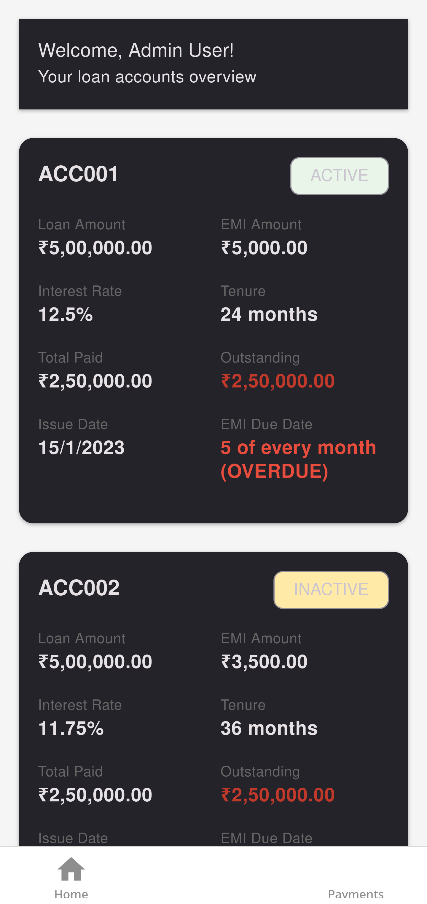
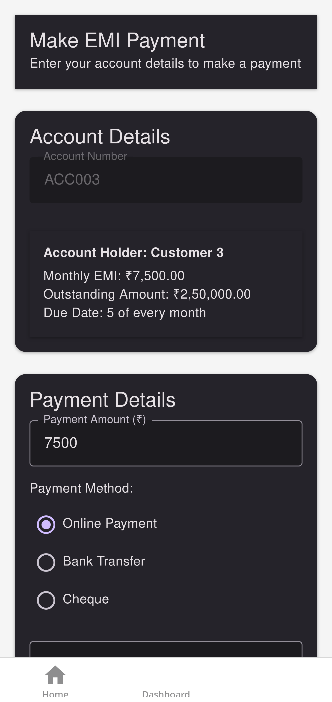

# Payment Collector App

A modern, full-stack mobile application for managing and collecting loan payments, built with React Native and a Node.js/Express backend.

| Dashboard | Payments Screen |
| :---: | :---: |
|  |  |

## Overview

This application provides a seamless experience for both collection agents and customers. Agents can view customer loan accounts, track payment statuses, and record new payments. The app features a secure authentication system and a clear, intuitive user interface.

## Features

- **Secure Authentication**: User registration and login with token-based authentication.
- **Customer Dashboard**: View a list of all loan accounts with key details like outstanding amount, EMI, and due dates.
- **Payment Processing**: A dedicated screen to make and record payments for a specific account.
- **Real-time Validation**: Input validation for payment amounts and account numbers.
- **Pull-to-Refresh**: Easily refresh the customer list on the dashboard.

## Tech Stack

- **Frontend**:
  - [React Native](https://reactnative.dev/)
  - [Expo](https://expo.dev/) (with Expo Router for file-based routing)
  - [React Native Paper](https://reactnativepaper.com/) for UI components
  - [React Context API](https://reactjs.org/docs/context.html) for state management

## Getting Started

### Prerequisites

- Node.js (v18 or later)
- npm or yarn
- Expo Go app on your mobile device or an Android/iOS emulator.

### Installation & Setup

1.  **Clone the repository:**
    ```bash
    git clone <repository-url>
    cd payment-collector-frontend
    ```

2.  **Install dependencies:**
    ```bash
    npm install
    ```

3.  **Set up the environment variables:**
    Create a `config.ts` file in the root directory and add your API base URL:
    ```typescript
    export const API_BASE_URL = 'http://localhost:3001/api';
    ```

4.  **Run the application:**
    ```bash
    npx expo start
    ```
    Scan the QR code with the Expo Go app on your phone, or run it on a simulator.

## Project Structure

```
.
├── app/                # Main application folder with screens
│   ├── (auth)/         # Authentication screens (login, register)
│   └── (tabs)/         # Main app screens after login (dashboard, payments)
├── assets/             # Images, fonts, and other static assets
│   └── screenshots/    # App screenshots
├── components/         # Reusable components (if any)
├── context/            # Global state management (AuthContext)
├── config.ts           # API configuration
└── ...                 # Other configuration files
```

## API Endpoints

The frontend interacts with a backend API. The key endpoints are:

- `POST /api/auth/register`: Create a new user account.
- `POST /api/auth/login`: Log in a user and get an authentication token.
- `GET /api/auth/verify`: Verify an existing token.
- `GET /api/customers/:userId`: Get all loan accounts for a specific user.
- `GET /api/payments/:account_number`: Get payment history for an account.
- `POST /api/payments`: Submit a new payment for an account.
